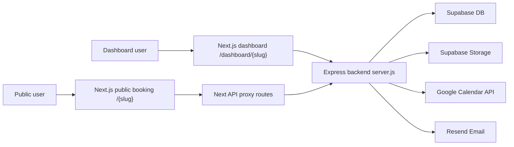
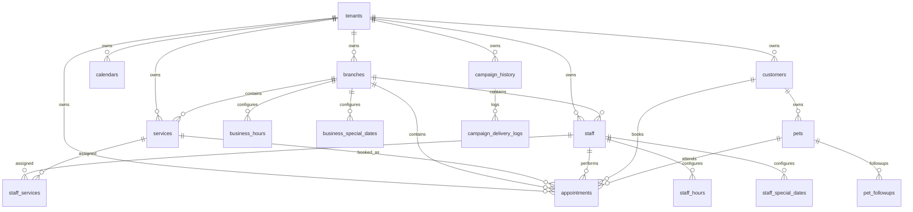
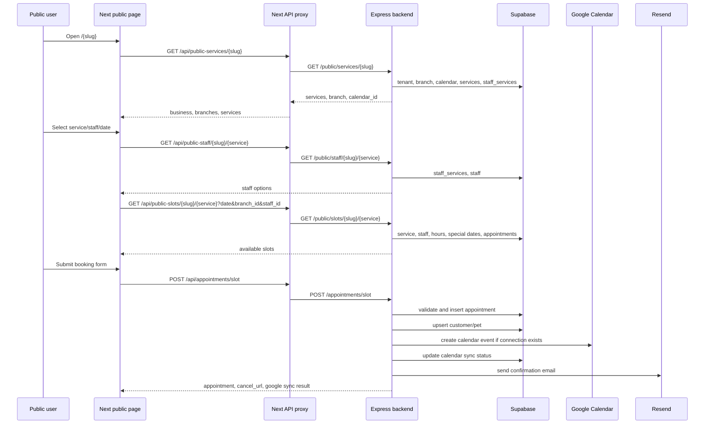
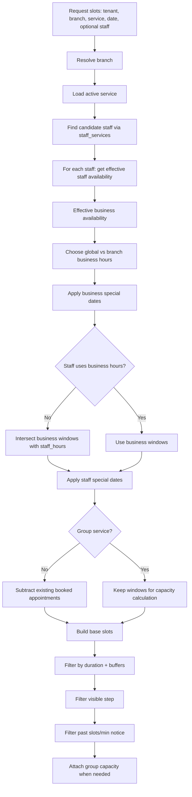
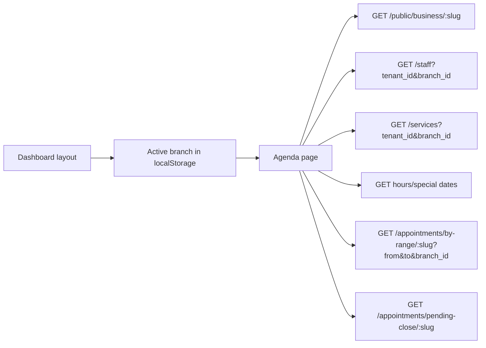
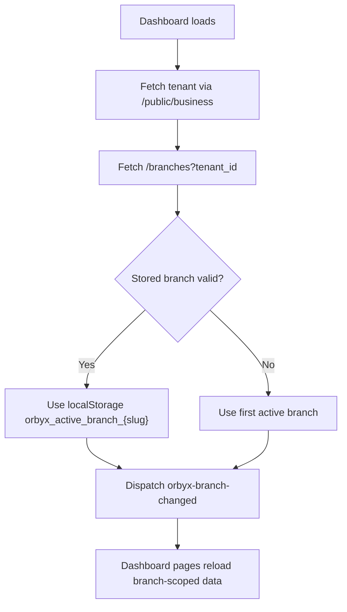
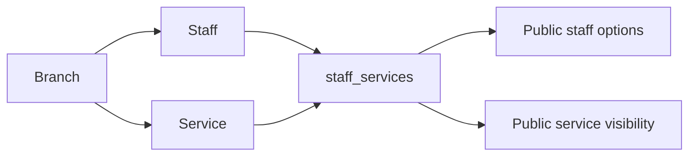
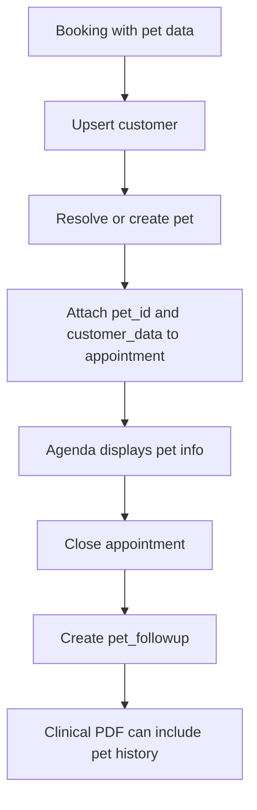
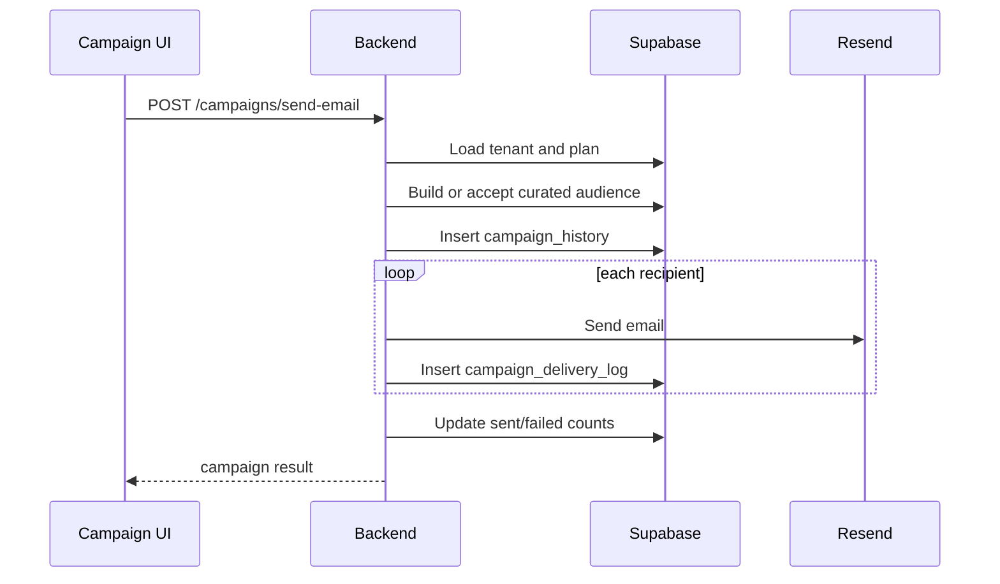
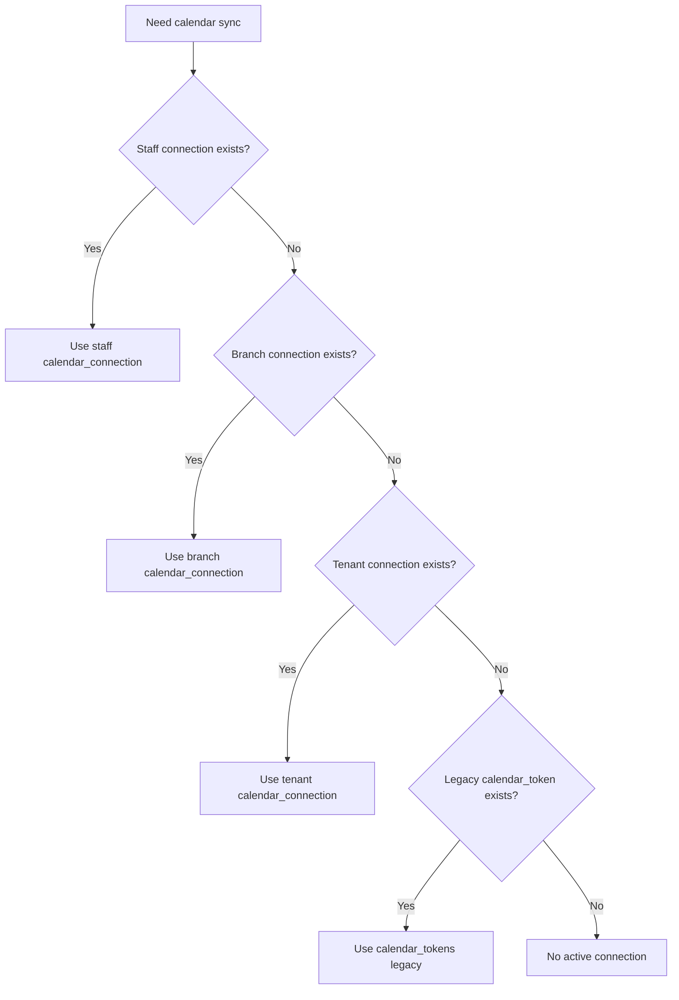

# Orbyx Architecture

Technical architecture reference for Orbyx.

This document describes the stable structure of the project, the main modules, how they connect, and the critical flows for booking, availability, agenda, campaigns, branches, services, customers, and Google Calendar.

## 1. System Overview

Orbyx is a multi-tenant SaaS booking platform.



Core stack:

| Layer | Technology | Location |
|---|---|---|
| Frontend | Next.js App Router, React client components | `orbyx-web/` |
| Backend | Node.js + Express | `server.js` |
| Database | Supabase Postgres | accessed from backend |
| Storage | Supabase Storage | staff photos, logos, campaign images |
| Calendar | Google Calendar OAuth/API | `server.js` |
| Email | Resend | `email.js` |

The backend is intentionally monolithic. Most business logic lives in `server.js`.

## 2. Repository Structure

```txt
.
|-- server.js
|-- email.js
|-- supabaseClient.js
|-- package.json
|-- *.sql
`-- orbyx-web/
    |-- app/
    |   |-- [slug]/page.tsx
    |   |-- api/
    |   |-- dashboard/[slug]/
    |   |-- cancel/[id]/page.tsx
    |   |-- onboarding/page.tsx
    |   |-- planes/
    |   `-- checkout/page.tsx
    |-- components/
    |-- lib/use-theme.ts
    |-- public/
    `-- package.json
```

## 3. Main Modules

| Module | Frontend | Backend | Main Tables |
|---|---|---|---|
| Public booking | `app/[slug]/page.tsx` | `/public/*`, `/appointments/slot` | `tenants`, `branches`, `services`, `staff`, `staff_services`, `appointments`, `customers`, `pets` |
| Dashboard shell | `dashboard/[slug]/layout.tsx` | `/public/business`, `/branches` | `tenants`, `branches` |
| Agenda | `dashboard/[slug]/agenda/page.tsx` | `/appointments/*`, `/staff`, `/services`, hours endpoints | `appointments`, `staff`, `services`, hours tables |
| Business config | `dashboard/[slug]/business/page.tsx` | `/tenants/:id`, `/business-hours`, `/business-special-dates`, `/booking-fields` | `tenants`, `business_hours`, `business_special_dates` |
| Branches | `dashboard/[slug]/branches/page.tsx` | `/branches` | `branches` |
| Staff | `dashboard/[slug]/staff/page.tsx` | `/staff`, `/staff-hours`, `/staff-special-dates`, `/staff-services` | `staff`, `staff_hours`, `staff_special_dates`, `staff_services` |
| Services | `dashboard/[slug]/services/page.tsx` | `/services`, `/staff-services` | `services`, `staff_services` |
| Customers | `dashboard/[slug]/customers/page.tsx` | `/customers/:slug`, `/pets`, `/pet-followups` | `customers`, `appointments`, `pets`, `pet_followups` |
| Campaigns | `dashboard/[slug]/campaigns/page.tsx` | `/campaigns/*`, `/campaign-images` | `customers`, `campaign_history`, `campaign_delivery_logs`, `campaign_images` |
| Calendar | `connect-calendar`, staff pages | `/auth`, `/oauth2callback`, `/calendar-connections` | `calendar_connections`, `calendar_tokens`, `appointments` |

## 4. Data Model

Detected core Supabase tables:

| Table | Purpose |
|---|---|
| `tenants` | Businesses/accounts. Stores slug, plan, category, booking rules, public profile |
| `tenant_users` | User-to-tenant ownership/roles |
| `branches` | Business locations/sucursales |
| `calendars` | Internal calendar config, slot interval, timezone |
| `calendar_connections` | OAuth calendar connections by tenant/branch/staff |
| `calendar_tokens` | Legacy Google Calendar tokens |
| `business_hours` | Weekly business hours, global or branch-scoped |
| `business_special_dates` | Special openings/closures, global or branch-scoped |
| `staff` | Professionals, branch-scoped |
| `staff_hours` | Weekly staff hours |
| `staff_special_dates` | Staff-specific special openings/closures |
| `services` | Bookable services, branch-scoped |
| `staff_services` | Relation between staff and services in a branch |
| `appointments` | Bookings/reservations |
| `customers` | Tenant customers |
| `pets` | Veterinary pets |
| `pet_followups` | Veterinary followups/next controls |
| `campaign_history` | Campaign send/save history |
| `campaign_delivery_logs` | Per-recipient delivery logs |
| `campaign_images` | Uploaded campaign images |

### Entity Relationships



## 5. Endpoint Map

### Public Booking Endpoints

| Method | Endpoint | Purpose |
|---|---|---|
| GET | `/public/business/:slug` | Public business config, booking limits, calendar id |
| GET | `/public/services/:slug` | Active services for tenant/branch, filtered to services with staff |
| GET | `/public/staff/:slug/:service_id` | Active staff assigned to service |
| GET | `/public/slots/:slug/:service_id` | Available slots for service/date/staff/branch |
| POST | `/appointments/slot` | Create appointment from public/manual booking |
| GET | `/booking-fields/:slug` | Public booking field config |
| PUT | `/booking-fields/:slug` | Update booking field config |

### Availability And Hours

| Method | Endpoint | Purpose |
|---|---|---|
| GET | `/business-hours` | Read global or branch business hours |
| PUT | `/business-hours` | Replace global or branch business hours |
| GET | `/business-special-dates` | Read global or branch special dates |
| POST | `/business-special-dates` | Create special date |
| PUT | `/business-special-dates/:id` | Update special date |
| DELETE | `/business-special-dates/:id` | Delete special date |
| GET | `/staff-hours` | Read staff weekly hours |
| PUT | `/staff-hours` | Replace staff weekly hours |
| GET | `/staff-special-dates` | Read staff special dates |
| POST | `/staff-special-dates` | Create staff special date |
| PUT | `/staff-special-dates/:id` | Update staff special date |
| DELETE | `/staff-special-dates/:id` | Delete staff special date |
| GET | `/slots` | Legacy/internal slots endpoint |

### Staff And Services

| Method | Endpoint | Purpose |
|---|---|---|
| GET | `/staff` | List staff by tenant/branch |
| POST | `/staff` | Create staff |
| PUT | `/staff/:id` | Update staff |
| DELETE | `/staff/:id` | Delete staff |
| GET | `/services` | List services by tenant/branch |
| POST | `/services` | Create service |
| PATCH | `/services/:id` | Update service |
| DELETE | `/services/:id` | Soft-delete service |
| GET | `/staff-services` | List staff-service relations |
| PUT | `/staff-services` | Replace relations for one staff |
| DELETE | `/staff-services/:id` | Delete relation |

### Appointments And Agenda

| Method | Endpoint | Purpose |
|---|---|---|
| GET | `/appointments` | List appointments by calendar |
| GET | `/appointments/:id` | Public appointment info for cancellation token |
| PATCH | `/appointments/:id` | Update appointment customer fields |
| DELETE | `/appointments/:id` | Cancel by token |
| POST | `/appointments/:id` | Cancel by token, compatibility route |
| PATCH | `/appointments/:id/status` | Update status |
| POST | `/appointments/:id/close` | Veterinary close with followup |
| PATCH | `/appointments/:id/clinical` | Save clinical data/followup |
| GET | `/appointments/by-day/:slug/:date` | Day appointments |
| GET | `/appointments/by-range/:slug` | Range appointments for agenda |
| GET | `/appointments/pending-close/:slug` | Past booked appointments |
| GET | `/appointments/search/:slug` | Search appointments |
| GET | `/appointments/customer-history/:slug` | Customer appointment history |

### Branches, Tenants, Billing

| Method | Endpoint | Purpose |
|---|---|---|
| GET | `/branches` | List branches by tenant |
| POST | `/branches` | Create branch with plan limit |
| PATCH | `/branches/:id` | Update branch |
| PATCH | `/tenants/:id` | Update business profile/config |
| POST | `/tenants/provision` | Provision tenant/user/calendar |
| GET | `/billing/preview-change` | Preview plan change |
| POST | `/billing/change-plan` | Apply/schedule plan change |
| POST | `/billing/apply-scheduled-changes` | Apply scheduled downgrades |
| PATCH | `/calendars/:id/slot-minutes` | Update calendar slot interval |

### Customers, Pets, Campaigns

| Method | Endpoint | Purpose |
|---|---|---|
| GET | `/customers/:slug` | List/search/segment customers |
| GET | `/pets/:slug` | List pets by customer/email/phone |
| POST | `/pets` | Create pet |
| GET | `/pet-followups/:slug` | List veterinary followups |
| GET | `/pets/:id/clinical-pdf` | Veterinary clinical PDF |
| POST | `/campaigns/send-email` | Send real email campaign |
| POST | `/campaigns/save-whatsapp` | Save WhatsApp campaign history/logs |
| GET | `/campaigns/history/:slug` | Campaign history |
| GET | `/campaigns/logs/:campaignId` | Campaign delivery logs |
| POST | `/upload/campaign-image` | Upload campaign image |
| GET | `/campaign-images/:slug` | List campaign images |
| DELETE | `/campaign-images/:id` | Delete campaign image |

### Calendar OAuth

| Method | Endpoint | Purpose |
|---|---|---|
| GET | `/auth` | Start Google OAuth |
| GET | `/oauth2callback` | Google OAuth callback |
| GET | `/auth/microsoft` | Start Microsoft OAuth path |
| GET | `/oauth2callback/microsoft` | Microsoft callback path |
| GET | `/calendar-connections` | List calendar connections |
| GET | `/test-event` | Test Google event creation |

## 6. Public Booking Flow



### Public Booking Responsibilities

Frontend:

- slug detection
- branch/service/staff/date selection
- form validation
- veterinary fields
- group slot display
- submission to proxy route

Backend:

- tenant/branch/service/staff validation
- effective availability calculation
- duplicate prevention
- group capacity enforcement
- appointment insert
- customer/pet upsert
- calendar sync
- confirmation email

## 7. Availability Flow



### Rule Priority

1. Branch must be valid and active.
2. Business hours provide base windows.
3. Branch hour flags decide whether global or branch hours are preferred.
4. Business special dates modify business windows.
5. Staff hours can narrow business windows.
6. Staff special dates modify staff windows.
7. Existing appointments reduce availability for individual services.
8. Group services use capacity instead of removing the slot.
9. Service duration and buffers must fit in contiguous slots.
10. Booking limits remove past/too-soon/far-future options.

## 8. Booking Validation And Appointment Creation

`POST /appointments/slot` is the canonical booking creation endpoint.

Main validation categories:

| Category | Validation |
|---|---|
| Required fields | `calendar_id`, `date`, `slot_start`, customer name/phone/email |
| Contact | valid email and Chilean mobile phone |
| Calendar | calendar exists and is active |
| Branch | branch belongs to tenant and is active |
| Tenant rules | min booking notice, max booking days ahead |
| Service | service belongs to tenant/branch and is not deleted |
| Availability | submitted slot must be present after recalculation |
| Duplicates | individual slots reject existing booked appointment |
| Group capacity | group slots allow bookings until capacity |
| Customer overlap | customer cannot have overlapping active appointments |

Appointment insert stores:

- tenant, branch, calendar, service, staff
- customer id and customer snapshot fields
- service snapshot name/duration
- start/end times
- source and status
- clinical fields when present
- cancel token
- calendar sync metadata
- veterinary `pet_id` and `customer_data` when present

## 9. Agenda Flow



Agenda behavior:

- Active branch controls all visible appointments, staff, and services.
- Staff filter can further narrow appointments.
- Service filter is mostly applied in frontend.
- Status filters are frontend-driven.
- Group appointments are visually grouped by block/time/staff/service.
- Veterinary close flow can mark appointments completed and create `pet_followups`.
- Cancel/status changes call backend and then reload/apply updates.

Statuses:

| Status | Meaning |
|---|---|
| `booked` | Active booking |
| `completed` | Attended/completed |
| `no_show` | Did not attend |
| `rescheduled` | Rescheduled |
| `canceled` | Canceled |

Agenda has local visual logic for closed windows and available slots. Backend availability remains the source of truth for actual booking.

## 10. Branches

Branches are central to Orbyx.

Branch fields include:

- identity/contact fields: name, slug, address, phone, WhatsApp, email, socials, map/location
- behavior flags: `use_global_socials`, `use_global_contact`, `use_global_hours`, `use_global_special_dates`
- active state

Dashboard active branch:



Rules:

- Branches should never be bypassed in dashboard modules.
- If a branch is inactive, it should not be used for public booking or dashboard active selection.
- Missing `branch_id` may resolve to the first active branch; this can hide bugs.

## 11. Services

Services are branch-scoped.

Important fields:

- `tenant_id`
- `branch_id`
- `name`
- `description`
- `duration_minutes`
- `buffer_before_minutes`
- `buffer_after_minutes`
- `price`
- `active`
- `deleted_at`
- `is_group`
- `capacity`

Service behavior:

- Public services are active, not deleted, and must have at least one staff relation.
- Soft delete sets `deleted_at` and `active = false`.
- Duration plus buffers determines slot fit and appointment end time.
- Group services use `capacity` and allow multiple appointments per same slot/staff until full.

## 12. Staff

Staff are branch-scoped professionals.

Important fields:

- `tenant_id`
- `branch_id`
- `name`
- `role`
- `email`
- `phone`
- `color`
- `photo_url`
- `is_active`
- `sort_order`
- `use_business_hours`

Staff behavior:

- Public staff must be active and assigned to the selected service.
- If `use_business_hours` is true, staff availability follows effective business hours.
- If false, staff availability is the intersection between business windows and staff-specific hours.
- Staff special dates override or subtract from the staff's final windows.

## 13. Staff-Service Relations

`staff_services` connects staff to services within a branch.



Important behavior:

- Public booking depends on these relations.
- Updating one staff's services replaces that staff's relation set for the branch.
- A service without staff relations is hidden from public booking.

## 14. Customers And Veterinary Data

Customers are tenant-scoped and updated from appointment creation.

Customer stats are recalculated from appointments:

- total visits
- last visit
- segmentation data

Veterinary mode is enabled for `business_category` values:

- `veterinaria`
- `vet`

Veterinary data flow:



## 15. Campaigns

Campaigns use customers and segmentation.

Segments:

- `new`
- `recurrent`
- `frequent`
- `inactive`

Email campaign flow:



WhatsApp campaign flow:

- `/campaigns/save-whatsapp` saves history and logs.
- It does not send real WhatsApp messages from backend.

Branch risk:

- Customers are tenant-scoped.
- Branch filtering is derived from appointment history when requested.
- Campaigns can become tenant-wide unless the frontend uses branch-filtered/curated audience.

## 16. Google Calendar

Calendar connection resolution:



Appointment creation behavior:

- Appointment is inserted first.
- Calendar sync is attempted afterward.
- On success, appointment stores provider/event metadata and `calendar_sync_status = "synced"`.
- On failure, appointment remains created and stores `calendar_sync_status = "error"` plus error text.

Cancellation/status behavior:

- Canceling an appointment attempts to delete the external calendar event.
- Calendar deletion failure is logged but should not prevent local cancellation.

## 17. Next API Proxy Routes

| Route | Backend target |
|---|---|
| `orbyx-web/app/api/public-services/[slug]/route.ts` | `/public/services/:slug`, then `/branches` |
| `orbyx-web/app/api/public-staff/[slug]/[service_id]/route.ts` | `/public/staff/:slug/:service_id` |
| `orbyx-web/app/api/public-slots/[slug]/[serviceId]/route.ts` | `/public/slots/:slug/:service_id` |
| `orbyx-web/app/api/appointments/slot/route.ts` | `/appointments/slot` |
| `orbyx-web/app/api/upload-business-logo/route.ts` | Supabase Storage |
| `orbyx-web/app/api/upload-staff-photo/route.ts` | Supabase Storage |

These routes are used mainly to normalize inputs or perform server-side storage operations.

## 18. Security And Ownership Rules

Important invariants:

- Do not expose Supabase service role keys to client components.
- Validate tenant ownership for branch, staff, service, appointment, customer, and pet IDs.
- Preserve cancel token validation for public cancellation.
- Public endpoints should only expose data needed for booking.
- Upload routes should validate file type, size, ownership, and target bucket when modified.
- Do not log OAuth tokens, access tokens, refresh tokens, API keys, or service role keys.

## 19. Known Technical Risks

| Risk | Why it matters |
|---|---|
| `server.js` monolith | Large blast radius; unrelated edits can break critical flows |
| Duplicate availability paths | Some endpoints use older helpers; public booking uses newer effective availability |
| Branch fallback | Missing `branch_id` can silently use first active branch |
| Special date semantics | Global special dates are still applied when local branch special dates are enabled |
| Timezone offsets | Some code uses fixed `-03:00` or `-04:00` along with `America/Santiago` |
| Campaign branch scope | Audiences may be tenant-wide unless branch-curated |
| Group booking concurrency | Capacity must remain safe under simultaneous bookings |
| Calendar sync | Must not roll back valid bookings when external calendar fails |
| Veterinary + group shared path | Public booking changes can accidentally break one mode while fixing another |
| Hardcoded backend URL | Many frontend files call production backend directly |

## 20. Deployment

Frontend changes:

```bash
cd orbyx-web
npm run build
```

Deploy frontend to the configured host, normally Vercel.

Backend changes:

```bash
npm start
```

Deploy or restart backend service, normally Render.

Documentation-only changes require no build or deploy.

